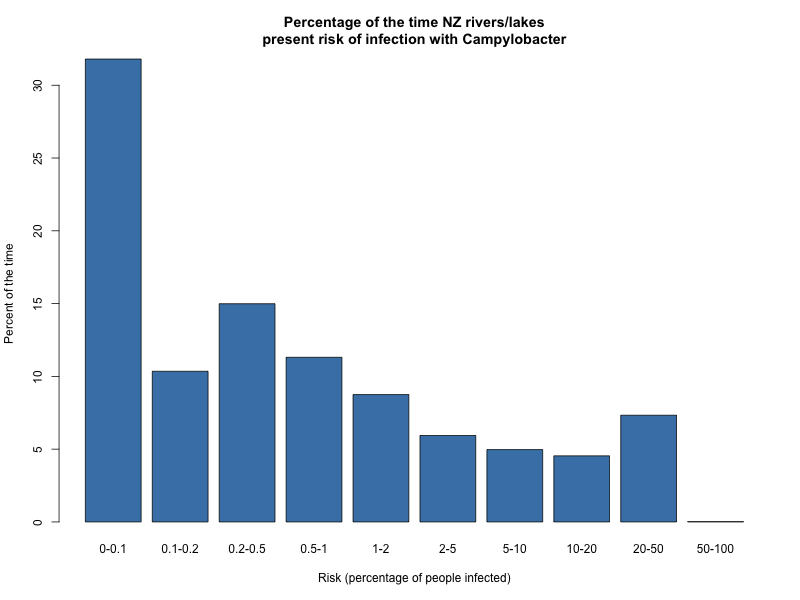

## nzwater

This repository contains a simple R script for reproducing a small portion of
the work of McBride et. al. from the report "Pathogen Occurrence and Human
Health Risk Assessment Analysis" which is available here:

http://www.mfe.govt.nz/sites/default/files/freshwater-microbiology-nov02.pdf

In particular, we reproduce the quantitative microbial risk assessment model
for *Campylobacter jejuni* infection risk to reproduce the results in table A3.7.3.

You should be able to produce a short document summarising the code by spinning
(via Compile Notebook in RStudio) `campy_risk.R`, or alternatively just running
it line by line. The table produced is the left hand column of table A3.7.3,
and you can get the actual samples from the Monte-Carlo in 'lots' which represents
the number of people (out of 1000) infected at each run.

Increasing the `reps` variable increases the number of
samples taken. Each one represents an event where 1000 people go to swim in the
same water body (for differing lengths of time, and ingesting different
amounts of water) and thus being exposed to the same concentration of
*Campylobacter jejuni* but ingesting different quantities. Note that this
is for infection, but not for illness: Some people may get infected with
*Campylobacter jejuni* but not show symptoms of illness.

Below is a graphical representation of the risk

